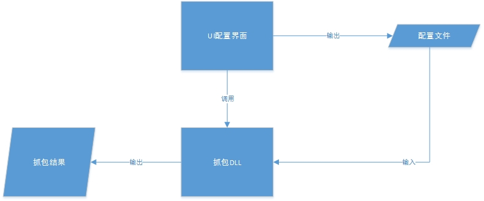

# NcgPcap
In terms of the logic of ncg, capture packets from network interface automatically, including the Command Interaction Packets and video stream Packets.

### 1. Architecture: ###

Users configure the NcgPcap through operating on the UI interface,
then UI interface will write the confiturations into a specific `conf` file.
That is all what UI interface do.

The real capturing is implementated in the npcap.dll.

### 2. Modify the logic of capturing. ###

- The vs project file(including `sln` and `vproject`) locates in the `\prj\MSVC\`.
  After modify the codes in `src` directory, the target directory of compilation is `bin\win32`.

- After modify the UI interface, you should execute `ui\makepy.ps1` to generate coresponding python codes,
which locates into `script\`.

- After modify the python codes in `\script\`, you should rebuild binary executable program by execute `MakeExe.bat` in the root dir of this project.

**Note:**
You should put the UI resource files(.ico, .jpg, etc.) into `\ui\rsc`, when you execute `MakeExe.bat`, files in that file will be copied into `\bin\win32\rsc\`.

### Final ###

The releasable is `\bin\win32\` directory.

